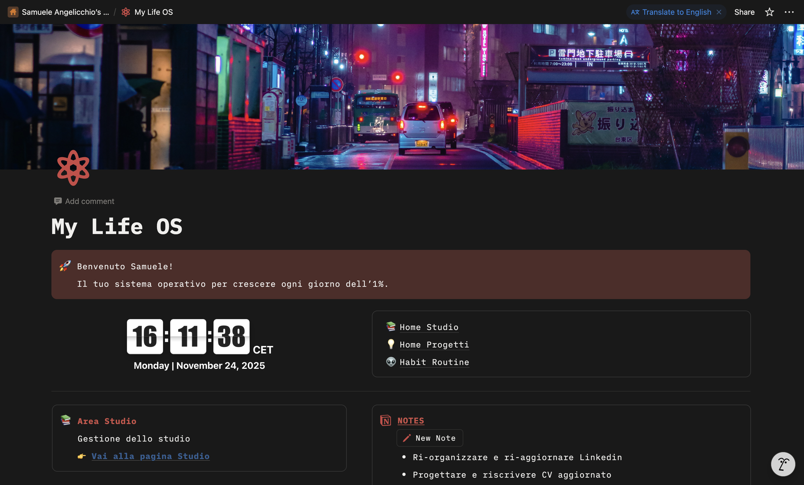
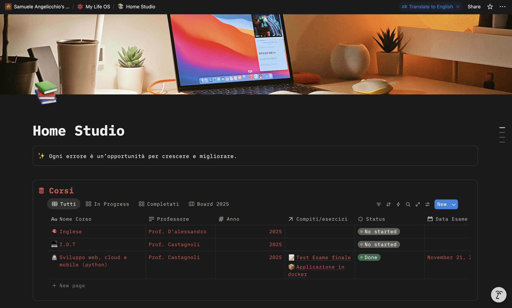
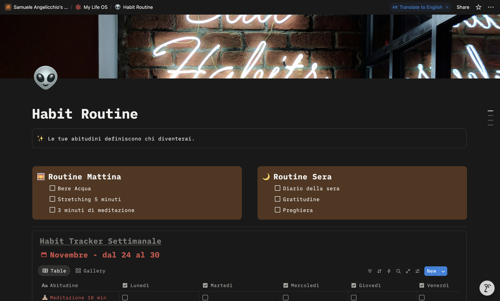
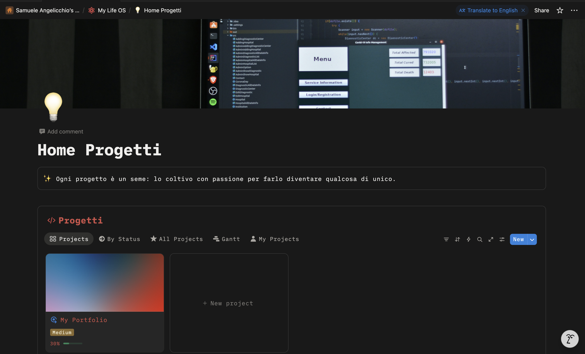

<h1 align="center">My Life OS – Sistema di Produttività</h1> 

 Una dashboard completa progettata in <b>Notion</b> per gestire studio, progetti, routine e note in uno spazio unico, chiaro e minimal. 

---

 
   
   
   
   
   
   

---

## Introduzione

Questo sistema l’ho creato per avere un punto unico dove organizzare davvero tutto: corsi, compiti, progetti, routine e note.
È una versione che unisce minimalismo, funzionalità e coerenza visiva.

La versione pubblica (DEMO) mostra la struttura del workspace senza includere dati personali, permettendo comunque di vedere come è stato progettato e come si integra ogni parte.

### Cosa include

- **Home Studio**
: Gestione dei corsi, compiti, scadenze e materiali.

- **Home Progetti**
: Tracciamento dei progetti personali con task collegate e viste dedicate.

- **Habit Routine**
: Routine mattutina/serale, micro-abitudini sostenibili e una semplice weekly review.

- **Notes & Library**
: Spazio per appunti veloci, link utili, idee e risorse ricorrenti.

- **Dashboard principale**
: Box uniformi, widget, layout modulare e navigazione immediata.

Tutto è stato costruito con l’obiettivo di essere chiaro, intuitivo e piacevole da usare ogni giorno.

---

## Tecnologie utilizzate

Notion — database relazionali, viste filtrate, layout modulari

Indify Widgets — elementi dinamici, come l’orologio centrale

UI personalizzata — palette coerente, box scuri, icone e struttura in tre colonne

---

## Anteprima

  
  

    
    
    
  

---

## Perché l’ho creato

Volevo un sistema che mi aiutasse a mantenere ordine, costanza e chiarezza mentale durante studio e progetti.
Un workspace che non fosse solo “funzionale”, ma che avesse anche un minimo di design che invoglia l’utilizzo.

Ho lavorato per creare una struttura pulita, equilibrata e utilizzabile tutti i giorni.

<h3 align="center">🔗 Demo pubblica</h3> 
  

<h3 align="center">👨‍💻 Autore</h3> 
 <b>Samuele Angelicchio</b>

